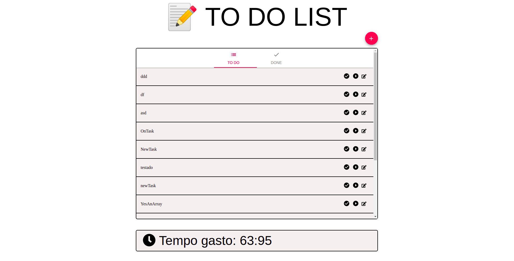

# 📝 ToDoApp


Um simples aplicativo de TodoList feito em ReactJS com crônometro e também calcula o tempo total trabalhado.

O que foi usado para contruir essa aplicação.

* [ReactJS](https://pt-br.reactjs.org/)
* [Material-UI](material-ui.com/pt/)
* [Pouchdb](pouchdb.com)
* [MomentJS](https://momentjs.com/)
* [FontAwesome](https://github.com/FortAwesome/react-fontawesome)
* [ESLint](https://eslint.org/)




## Como rodar

### Pré-requisitos
* [NPM](https://www.npmjs.com/)
* [Yarn](https://yarnpkg.com/)
* [Node.js](https://nodejs.org/en/)

```bash
$ yarn //Para instalar as dependêncais
$ yarn start //Para rodar o projeto
```

## Sobre o Puchdb

É um banco de dados bem simples onde precisei apenas escrever 3 funções para salvar as tarefas, sem necessidade de api ou qualquer complexidade. Todo o código feito para usa-lo está em 
```
services/pouchdb.js
```

<p align="center">Made whit ❤ by <strong><a href="http://linkedin.com/in/cristian-silva-dev" target="blank" >Cristian</></p></strong>